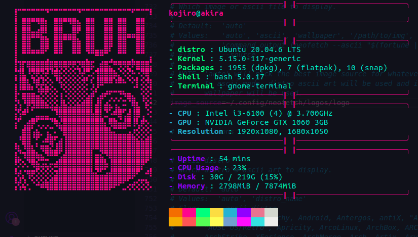
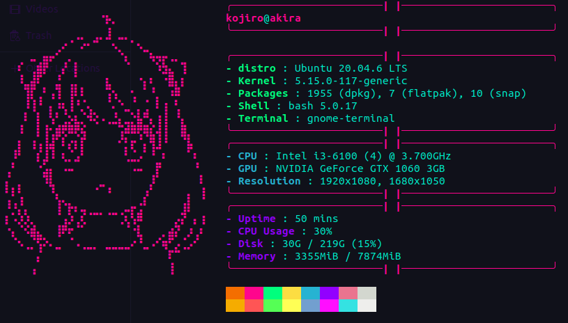
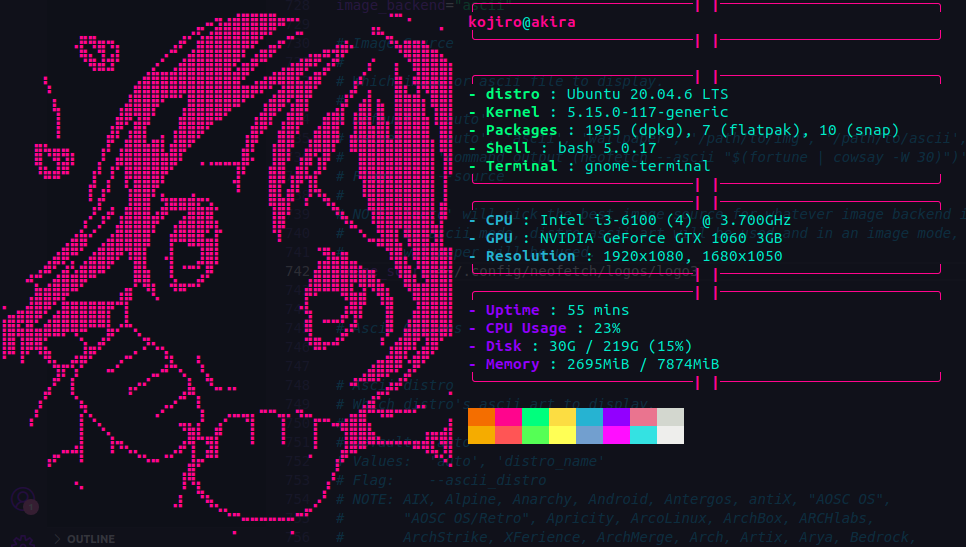
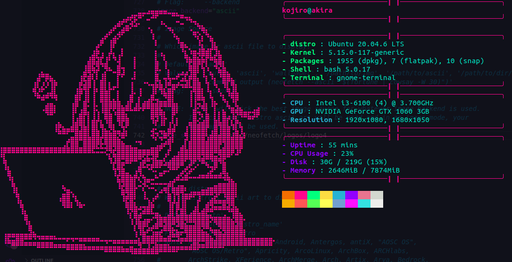
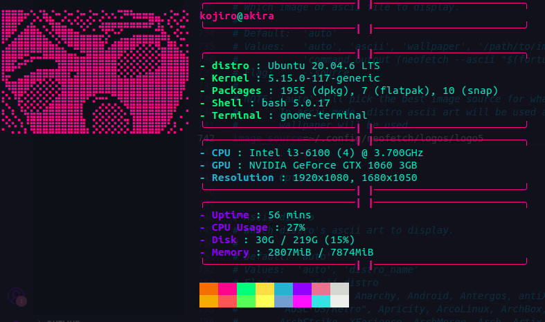

# Blossom Theme for Neofetch

## Preview






## Installation
1. Clone the repository.
```git clone https://github.com/BlossomTheme/Neofetch.git```

2. Copy the ```config.conf``` file and the ```logos directory``` to ```~/.config/neofetch```.
```cp ./config.conf ~/.config/neofetch && cp -r ./logos/ ~/.config/neofetch```

3. Run neofetch.
```neofetch```

## Customization
- Currently there are 5 logos which can be displayed.
- To change the logo change the ```image_source``` variable in the ```config.conf``` (line742) to a logo of your choice (logo1 - logo5).
- All the logos are contained in the [logos](./logos/) directory.
- Feel free to contribute more logos! 
